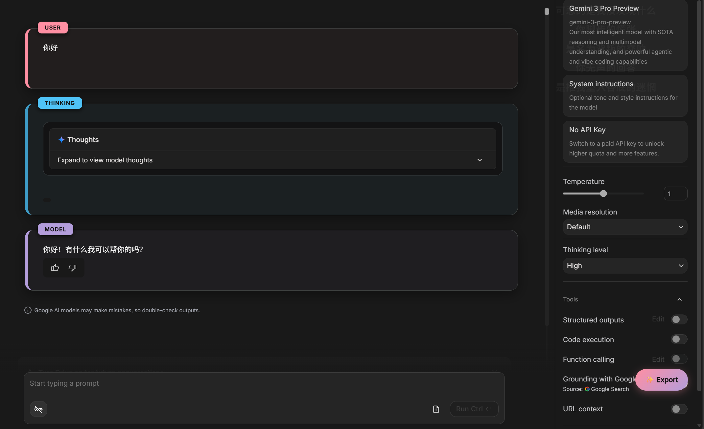

# Gemini AI Studio UI Enhancer 🎨

  

一个用于优化 **Google AI Studio** (`aistudio.google.com`) 使用体验的 Tampermonkey (油猴) 脚本。
它不仅美化了对话界面，还重点增强了对 **Gemini 2.0 Flash Thinking** 等模型的**思维链 (Chain of Thought)** 的展示，并提供了便捷的对话导出功能。

## ✨ 核心功能

### 1. 🎨 沉浸式 UI 美化
- **卡片式对话框**：将原本平铺的对话流改为独立的卡片样式，增加阴影和圆角，阅读体验更佳。
- **角色颜色区分**：
  - 👤 **User (用户)**：柔和的粉色调 (`#ff8fa3`)。
  - 🤖 **Model (模型)**：优雅的紫色调 (`#b39ddb`)。
  - 🧠 **Thinking (思维链)**：清新的青色调 (`#4fc3f7`)，用于区分模型思考过程与正式回答。
- **标签增强**：每个对话框左上角自动添加 `USER`、`MODEL`、`THINKING` 的胶囊标签，一目了然。

### 2. 🧠 智能思维链识别
- 精准识别 `ms-thought-chunk` 节点。
- 当模型正在思考时，界面会高亮显示“思考中”的状态。
- 将冗长的思维过程包裹在独立的样式块中，与最终输出结果区分开来。

### 3. 📦 对话导出 (Export)
在页面右下角集成了一个悬浮按钮面板：
- **📝 Export Markdown**：导出为 Markdown 格式。
  - 自动保留思维链内容（以引用块 `> Thoughts:` 形式展示）。
  - 完美适配主流笔记软件 (Obsidian, Notion 等)。
- **📋 Export JSON**：导出为 JSON 数据格式，方便开发者二次处理或归档。

### 4. ⚡ 性能与兼容性
- **高性能 DOM 监听**：使用优化过的 `MutationObserver`，仅对新增节点进行处理，避免长对话卡顿。
- **TrustedHTML 兼容**：采用标准 DOM API 创建元素，解决了部分浏览器环境下的安全报错问题。

## 🛠️ 安装与使用

### 前置条件
你需要安装浏览器扩展程序 **Tampermonkey** (油猴)。
- [Chrome / Edge 版本](https://chrome.google.com/webstore/detail/tampermonkey/dhdgffkkebhmkfjojejmpbldmpobfkfo)
- [Firefox 版本](https://addons.mozilla.org/zh-CN/firefox/addon/tampermonkey/)

### 安装步骤
1. 点击 [GitHub 仓库](你的GitHub仓库链接) 中的脚本文件 (通常是 `gemini-ui.user.js`)。
2. 或者在 Tampermonkey 中新建脚本，将代码完整复制粘贴进去。
3. 保存即可生效。

### 如何使用
1. 打开 [Google AI Studio](https://aistudio.google.com/)。
2. 开始对话，你将看到界面样式已自动应用。
3. 点击页面右下角的 **✨ Export** 悬浮按钮，选择你需要的格式下载对话记录。

## 📸 预览 (Screenshots)

|                          正常对话流                          |                           导出菜单                           |
| :----------------------------------------------------------: | :----------------------------------------------------------: |
|  |  |

## 📝 更新日志

### v3.3
- 🔧 核心逻辑重构：优化 `MutationObserver` 监听性能。
- 🐛 修复 `TrustedHTML` 报错问题。
- ✨ 新增思维链 (Thinking Process) 的独立着色和识别逻辑。
- 🎨 调整配色方案，使用更护眼的暗色模式适配颜色。

## 🤝 贡献 (Contributing)

欢迎提交 Issues 或 Pull Requests 来改进此脚本！

## 📄 许可证 (License)

本项目采用 [MIT License](LICENSE) 许可证。

---

**Disclaimer**: This script is a third-party tool and is not affiliated with Google.
